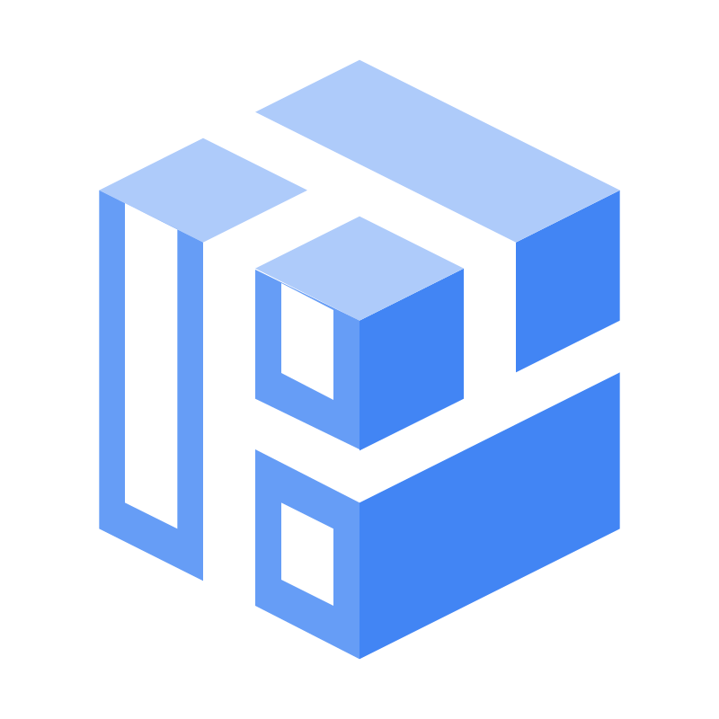
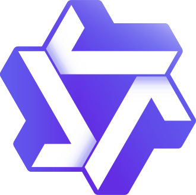
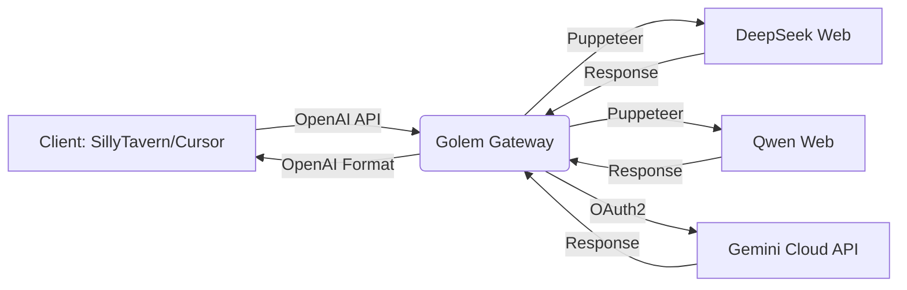

<div align="right">
 <a href="README.md">🇷🇺 Русский</a> | <strong>🇬🇧 English</strong>
</div>

#  Golem Gateway (AI Core)

<p align="center">
 
</p>

<p align="center">
 <a href="https://github.com/GrishaDeLumiere/golem-gateway/releases">
 
 </a>
 
 
 
</p>

<p align="center">
 <strong>A modular stateless router for large language models</strong><br>
 <em>The invisible bridge between AI web interfaces and standard API clients</em>
</p>

---

## 🎯 About the Project

**Golem Gateway** is a transparent proxy gateway that provides a unified REST interface fully compatible with the **OpenAI API** standard, utilizing headless browser automation (Puppeteer) and **XHR/Fetch** request interception.

> 💡 **The idea is simple:** you work with your favorite clients (SillyTavern, Cursor, Cline), while Golem seamlessly routes requests through web sessions, bypassing direct API restrictions.

---

## 🧩 Supported Providers

| Provider | Icon | Method | Features | Status |
|----------|------|--------|----------|--------|
| **DeepSeek** |  | `Puppeteer + XHR` | Session capture, auto-sterilization of history | ✅ Stable |
| **Qwen** |  | `Puppeteer + Fetch` | Local sessions, account pool management | ✅ Stable |
| **Gemini** |  | `OAuth2 + Google Cloud Code Assist` | Multi-accounts, thinking budget, web search | ✅ Stable |

---

## ✨ Key Features



- **🔌 Full OpenAI API Compatibility**
 Native support for `/v1/models` and `/v1/chat/completions` endpoints (including `stream: true`). Works "out of the box" with any client.

- **🎨 Dashboard Component**
 A modern web interface on `:7777` with an animated background, particle settings, token management, and a real-time core updater.

- **🧠 Dynamic Memory Management**
 Toggle neural network modules on the fly. Unused adapters are instantly unloaded from RAM without requiring a server restart.

- **🧹 Automatic Session Sterilization**
 Shadow sessions on target platforms (DeepSeek, Qwen) are deleted immediately after generating a response — keeping your account completely clean.

- **🧱 Modular Architecture**
 Router pattern + isolated providers (`providers/`). Adding a new neural network takes ~15 minutes.

---

## 🛠 Tech Stack

<p align="center">
 
 
 
 
 <br>
 
 
 
 
</p>

---

## 🚀 Quick Start

### ▶️ One-Click Launch (Windows)
```powershell
# 1. Download the repository
# 2. Run start.bat — the script will handle the rest:
# ✓ Node.js check
# ✓ npm install
# ✓ Auto-launch Dashboard in browser
```

### 🐧 Linux / macOS (Manual)
```bash
# 1. Clone the repository
git clone https://github.com/GrishaDeLumiere/golem-gateway.git
cd golem-gateway

# 2. Install dependencies
npm install

# 3. Start the core
node start.js

# 4. Open in browser:
# 👉 http://127.0.0.1:7777
```

---

## 🔌 Client Integration

### ⚙️ Connection Settings
| Parameter | Value |
|-----------|-------|
| **API Type** | `OpenAI Compatible` / `Custom Endpoint` |
| **Base URL** | `http://127.0.0.1:7777/v1` |
| **API Key** | *any text* (or the token from the "System" tab) |

### 🎭 Client-Specific Notes
- **SillyTavern**: For Gemini use `http://127.0.0.1:7777/` (without `/v1`) in *Google AI Studio* mode.
- **Cursor / Cline / Roo Code**: Work natively via the standard OpenAI format.
- **Regular Expressions**: Use your client's built-in tools to filter system tags (`<think>`, web search) out of the character's memory.

---

## 🧱 Architecture: How to add a new provider

```
📦 providers/
 ┣ 📜 index.js # Provider registry
 ┣ 📜 deepseek.js # Example: session interception
 ┣ 📜 qwen.js # Example: local sessions
 ┗ 📜 gemini.js # Example: OAuth2 + Cloud API
```

**Workflow:**
1. Create a file `providers/newprovider.js`
2. Implement 4 lifecycle functions:
 ```js
 initProvider(port) // Initialization
 setupRoutes(app, port) // Routes and logic
 handleChatCompletion() // Request processing
 unloadProvider() // Memory cleanup
 ```
3. Register the provider in `providers/index.js`
4. Add UI elements to `dashboard.html` and logic in `settings.js`

> 🎯 **Goal:** add a new provider in just 15-20 minutes.

---

## 📫 Contact & Support

<p align="center">
 <a href="https://github.com/GrishaDeLumiere/golem-gateway/issues">
 
 </a>
 <a href="https://t.me/GrishaDeLumiere">
 
 </a>
 <a href="https://discord.com/users/__grisha__">
 
 </a>
 <a href="mailto:contact.wardencraft@gmail.com">
 
 </a>
</p>

---

<p align="center">
 <sub>Developed with 💜 by <b>GrishaDeLumiere</b> • <a href="https://github.com/GrishaDeLumiere/golem-gateway/blob/main/LICENSE">AGPL-3.0 License</a> • 2026</sub>
</p>