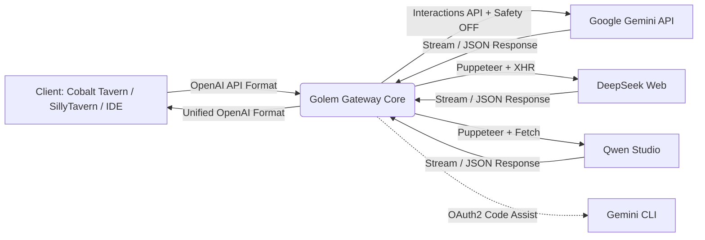

<div align="right">
 <a href="README.md">🇷🇺 Русский</a> | <strong>🇬🇧 English</strong>
</div>

#  Golem Gateway (AI Core)

<p align="center">
 
</p>

<p align="center">
 <a href="https://github.com/GrishaDeLumiere/golem-gateway/releases">
 
 </a>
 
 
 
</p>

<p align="center">
 <strong>A modular stateless router for large language models</strong><br>
 <em>A unified gateway connecting web sessions, official APIs, and third-party AI clients</em>
</p>

---

## 🏆 Recommended UI: Cobalt Tavern

<p align="center">
  <a href="https://github.com/GrishaDeLumiere/cobalt-tavern" target="_blank">
    
  </a>
</p>

To unlock the full potential of **Golem Gateway**, we strongly recommend using **[Cobalt Tavern](https://github.com/GrishaDeLumiere/cobalt-tavern)** — the ultimate, uncompromising, and ultra-fast SolidJS LLM interface designed for full control with zero lag.

- ⚡ **Ultra-Fast SolidJS Engine:** Lightning-fast responsiveness and smooth 60 FPS even on massive chats with 5,000+ messages.
- 🏗 **Prompt Builder & CST Syntax:** Byte-level context control, concrete syntax trees, `IF/ELSE` logical branches, and real-time visual assembly matrix.
- 🧠 **Advanced Lore Engine:** Lorebook scanner powered by boolean logic (`AND ALL`, `AND ANY`, `NOT ALL`, `NOT ANY`) with recursion control.
- 🛡 **3-Layer Regex Filtering:** Surgical cleanup for Incoming responses, Outgoing prompts, and Visual-only browser rendering.
- 💡 **Native `<think>` Streaming:** Real-time reasoning block streaming with live generation speed metrics (tokens/sec).
- 🔌 **Seamless Golem Integration:** Native support for Golem model prefixes (`gemini-api/`, `gemini-cli/`, `deepseek/`, `qwen/`).

---

## 🎯 About the Project

**Golem Gateway** is a high-performance local proxy gateway that provides a unified REST interface compatible with the standard **OpenAI API** (`/v1/chat/completions`, `/v1/models`). It bridges headless browser automation (Puppeteer), **XHR/Fetch** request interception, and official API key pools with granular censorship controls and prefix-based routing.

> 💡 **The concept:** connect your favorite clients ([Cobalt Tavern](https://github.com/GrishaDeLumiere/cobalt-tavern), SillyTavern, Cursor, Cline, Roo Code), and Golem manages routing, token pools, censorship bypass, and active sessions behind the scenes.

---

## 🧩 Supported Providers

| Provider | Icon | Method | Key Features | Status |
|----------|------|--------|--------------|--------|
| **Gemini (Official API)** |  | `Google REST & Interactions API` | `AIzaSy...` key pool, Safety filter bypass (OFF), Gemini 3.7+ support | ✅ Stable |
| **DeepSeek** |  | `Puppeteer + XHR` | Session capture, Visible/Headless toggle, `<think>` reasoning tag control | ✅ Stable |
| **Qwen Studio** |  | `Puppeteer + Fetch` | Local browser sessions, account pool management | ✅ Stable |
| **Gemini (CLI)** |  | `OAuth2 + Google Code Assist` | 💀 **Restricted by Google for individuals.** Enterprise only | ⚠️ Restricted |

---

## ✨ Key Features


```mermaid
graph LR
 A[Client: Cobalt Tavern / SillyTavern / IDE] -->|OpenAI API Format| B(Golem Gateway Core)
 B -->|Interactions API + Safety OFF| C[Google Gemini API]
 B -->|Puppeteer + XHR| D[DeepSeek Web]
 B -->|Puppeteer + Fetch| E[Qwen Studio]
 B -.->|OAuth2 Code Assist| F[Gemini CLI]
 C & D & E -->|Stream / JSON Response| B -->|Unified OpenAI Format| A
```

- **🔌 Full OpenAI API Compatibility**
 Native support for `/v1/models` and `/v1/chat/completions` endpoints (including real-time Server-Sent Events `stream: true`).

- **🛡️ Granular Safety Settings Bypass**
 Automatically injects `OFF` threshold for *Harassment, Hate Speech, Sexually Explicit, Dangerous Content*, as well as advanced categories like *Civic Integrity* and *Jailbreak Filter*.

- **📦 Interactive Model Hub**
 Dedicated modal window listing all active models across providers, complete with category filters, model counters, and one-click ID copying.

- **🔀 Collision-Free Prefix Routing**
 Explicitly target any provider using model prefixes:
  - `gemini-api/gemini-2.5-flash` → routes strictly to the Official Google API.
  - `gemini-cli/gemini-2.5-flash` → routes strictly to the CLI / OAuth adapter.
  - `deepseek/deepseek-chat` → routes strictly to the DeepSeek adapter.
  - `qwen/qwen-max` → routes strictly to the Qwen adapter.

- **🧠 Dynamic Memory Management**
 Enable or disable neural network modules on the fly — unused adapters are immediately unloaded from system RAM.

---

## 🛠 Tech Stack

<p align="center">
 
 
 
 
 <br>
 
 
 
 
</p>

---

## 🚀 Quick Start

### ▶️ One-Click Launch (Windows)
```powershell
# 1. Download the repository
# 2. Run start.bat — the script will:
# ✓ Check Node.js environment
# ✓ Install dependencies (npm install)
# ✓ Launch the server and open the dashboard in your browser
```

### 🐧 Linux / macOS (Manual)
```bash
# 1. Clone repository
git clone https://github.com/GrishaDeLumiere/golem-gateway.git
cd golem-gateway

# 2. Install dependencies
npm install

# 3. Start core
node start.js

# 4. Open dashboard in browser:
# 👉 http://127.0.0.1:7777
```

---

## 🔌 Client Integration

### ⚙️ Connection Settings
| Parameter | Value |
|-----------|-------|
| **API Type** | `OpenAI Compatible` / `Chat Completion` |
| **Base URL** | `http://127.0.0.1:7777/v1` |
| **API Key** | *Any string* (or your Master Key from the "System" tab) |

### 🎭 Integration Examples
- **Cobalt Tavern / SillyTavern:** Select `Custom (OpenAI-compatible)` API, enter `http://127.0.0.1:7777/v1` as the reverse proxy URL.
- **Explicit Routing:** Specify the prefixed model name in your client:
  - `gemini-api/gemini-3.7-flash` (Google Interactions API)
  - `deepseek/deepseek-v4-flash` (DeepSeek Web session)

---

## 🧱 Architecture

```
📦 golem-gateway/
 ┣ 📂 providers/               # Isolated AI provider modules
 ┃ ┣ 📜 deepseek.js           # Puppeteer + XHR interception
 ┃ ┣ 📜 qwen.js               # Puppeteer + Fetch sessions
 ┃ ┣ 📜 gemini-interaction.js # Official Google API + Safety bypass
 ┃ ┗ 📜 gemini.js             # CLI OAuth adapter
 ┣ 📂 public/                 # Modular ES6 frontend
 ┃ ┣ 📂 js/managers/          # Modal, Model, and Account managers
 ┃ ┗ 📜 dashboard.css         # Cyberpunk Glassmorphism stylesheet
 ┣ 📂 views/                  # HTML templates & modal components
 ┣ 📜 settings.js             # Core configuration management
 ┗ 📜 start.js                # Express gateway server & routing
```

---

## 📫 Contact & Support

<p align="center">
 <a href="https://github.com/GrishaDeLumiere/golem-gateway/issues">
 
 </a>
 <a href="https://t.me/GrishaDeLumiere">
 
 </a>
 <a href="https://discord.com/users/__grisha__">
 
 </a>
 <a href="mailto:contact.wardencraft@gmail.com">
 
 </a>
</p>

---

<p align="center">
 <sub>Developed with 💜 by <b>GrishaDeLumiere</b> • <a href="https://github.com/GrishaDeLumiere/golem-gateway/blob/main/LICENSE">AGPL-3.0 License</a> • 2026</sub>
</p>