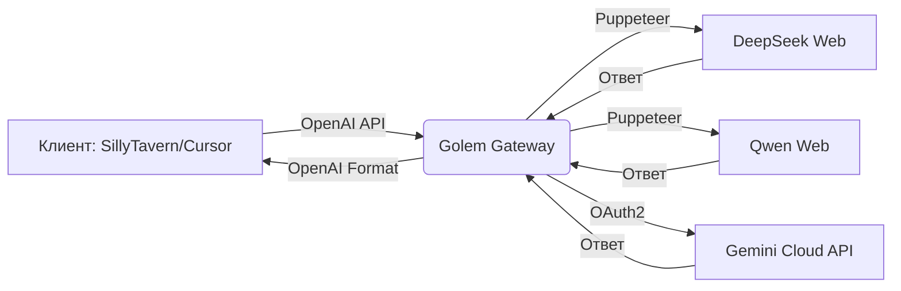

# 🧠 Golem Gateway (AI Core)

<p align="center">
 
</p>

<p align="center">
 
 
 
 
 <br>
 
 
</p>

---

## 🎯 О проекте

**Golem Gateway** — это невидимый мост между веб-интерфейсами искусственного интеллекта и стандартными API-клиентами. Шлюз предоставляет единый REST-интерфейс, полностью совместимый со стандартом **OpenAI API**, используя автоматизацию headless-браузеров (Puppeteer) и перехват **XHR/Fetch** запросов.

> 💡 **Идея проста:** вы работаете с любимыми клиентами (SillyTavern, Cursor, Cline), а Golem незаметно маршрутизирует запросы через веб-сессии, обходя ограничения прямых API.

### 🧩 Поддерживаемые провайдеры

| Провайдер | Метод | Особенности | Статус |
|-----------|-------|-------------|--------|
| **DeepSeek** | `Puppeteer + XHR` | Захват сессии, авто-стерилизация истории | ✅ Стабильно |
| **Qwen** | `Puppeteer + Fetch` | Локальные сессии, управление пулом аккаунтов | ✅ Стабильно |
| **Gemini** | `OAuth2 + Google Cloud Code Assist` | Мульти-аккаунты, thinking budget, веб-поиск | ✅ Стабильно |

---

## ✨ Ключевые возможности



- **🔌 Полная совместимость с OpenAI API**
 Нативная поддержка эндпоинтов `/v1/models` и `/v1/chat/completions` (включая `stream: true`). Работает "из коробки" с любым клиентом.

- **🎨 Панель управления (Dashboard)**
 Современный веб-интерфейс на `:7777` с анимированным фоном, настройками частиц, управлением токенами и реал-тайм апдейтером ядра.

- **🧠 Динамическое управление памятью**
 Включайте/выключайте модули нейросетей на лету. Ненужные адаптеры мгновенно выгружаются из ОЗУ без перезагрузки сервера.

- **🧹 Автоматическая стерилизация сессий**
 Теневые сессии на целевых платформах (DeepSeek, Qwen) удаляются сразу после генерации ответа — ваш аккаунт остаётся чистым.

- **🧱 Модульная архитектура**
 Паттерн Router + изолированные провайдеры (`providers/`). Добавление новой нейросети занимает ~15 минут.

---

## 🛠 Технологический стек

<p align="center">
 
 
 
 
 <br>
 
 
 
 
</p>

---

## 🚀 Быстрый старт

### ▶️ Запуск в один клик (Windows)
```powershell
# 1. Скачайте репозиторий
# 2. Запустите start.bat — всё остальное сделает скрипт:
# ✓ Проверка Node.js
# ✓ npm install
# ✓ Авто-открытие дашборда в браузере
```

### 🐧 Linux / macOS (Вручную)
```bash
# 1. Клонируйте репозиторий
git clone https://github.com/GrishaDeLumiere/golem-gateway.git
cd golem-gateway

# 2. Установите зависимости
npm install

# 3. Запустите ядро
node start.js

# 4. Откройте в браузере:
# 👉 http://127.0.0.1:7777
```

---

## 🔌 Интеграция с клиентами

### ⚙️ Настройка подключения
| Параметр | Значение |
|----------|----------|
| **API Type** | `OpenAI Compatible` / `Custom Endpoint` |
| **Base URL** | `http://127.0.0.1:7777/v1` |
| **API Key** | *любой текст* (или токен из вкладки «Система») |

### 🎭 Особенности для разных клиентов
- **SillyTavern**: Для Gemini используйте `http://127.0.0.1:7777/` (без `/v1`) в режиме *Google AI Studio*.
- **Cursor / Cline / Roo Code**: Работают нативно через стандартный OpenAI-формат.
- **Регулярные выражения**: Используйте встроенные инструменты вашего клиента, чтобы фильтровать служебные теги (`<think>`, веб-поиск) из памяти персонажа.

---

## 🧱 Архитектура: Как добавить новый провайдер

```
📦 providers/
 ┣ 📜 index.js # Реестр провайдеров
 ┣ 📜 deepseek.js # Пример: перехват сессии
 ┣ 📜 qwen.js # Пример: локальные сессии
 ┗ 📜 gemini.js # Пример: OAuth2 + Cloud API
```

**Алгоритм добавления:**
1. Создайте файл `providers/newprovider.js`
2. Реализуйте 4 функции жизненного цикла:
 ```js
 initProvider(port) // Инициализация
 setupRoutes(app, port) // Роуты и логика
 handleChatCompletion() // Обработка запросов
 unloadProvider() // Очистка памяти
 ```
3. Зарегистрируйте провайдер в `providers/index.js`
4. Добавьте UI-элементы в `dashboard.html` и логику в `settings.js`

> 🎯 **Цель:** добавить нового провайдера за 15-20 минут.

---

## 📫 Связь и поддержка

<p align="center">
 <a href="https://github.com/GrishaDeLumiere/golem-gateway/issues">
 
 </a>
 <a href="https://t.me/GrishaDeLumiere">
 
 </a>
 <a href="https://discord.com/users/__grisha__">
 
 </a>
 <a href="mailto:contact.wardencraft@gmail.com">
 
 </a>
</p>

---

<p align="center">
 <sub>Разработано с 💜 <b>GrishaDeLumiere</b> • <a href="https://github.com/GrishaDeLumiere/golem-gateway/blob/main/LICENSE">MIT License</a> • 2026</sub>
</p>
