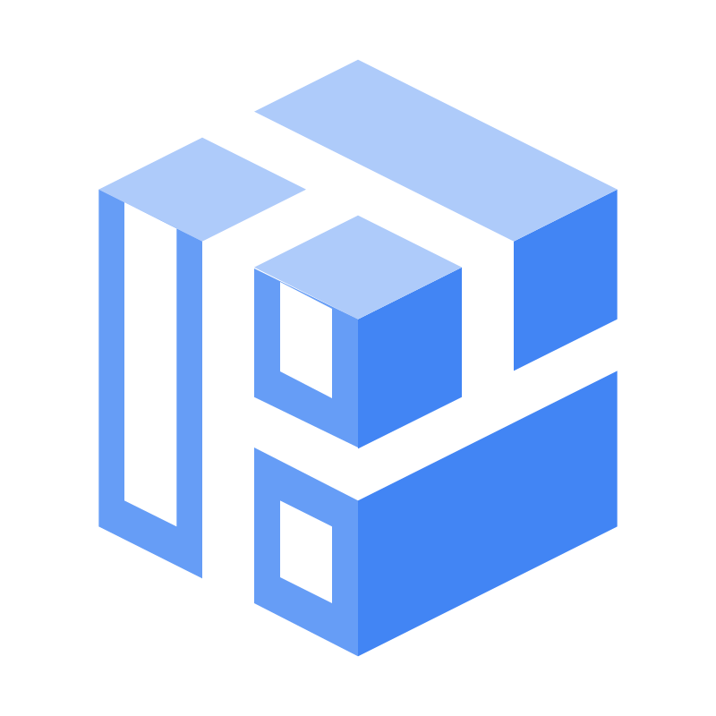
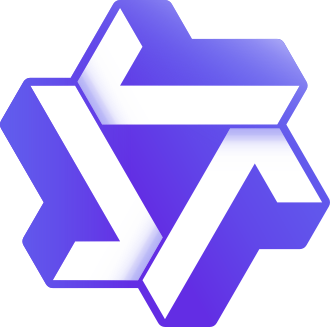
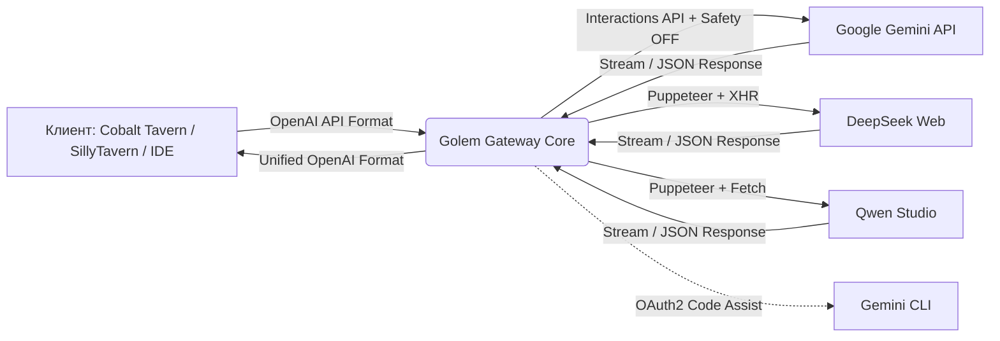

<div align="right">
 <strong>🇷🇺 Русский</strong> | <a href="README.en.md">🇬🇧 English</a>
</div>

#  Golem Gateway (AI Core)

<p align="center">
 
</p>

<p align="center">
 <a href="https://github.com/GrishaDeLumiere/golem-gateway/releases">
 
 </a>
 
 
 
</p>

<p align="center">
 <strong>Модульный stateless-маршрутизатор для больших языковых моделей</strong><br>
 <em>Единый шлюз между веб-интерфейсами, официальными API и сторонними клиентами</em>
</p>

---

## 🏆 Рекомендуемый клиент: Cobalt Tavern

<p align="center">
  <a href="https://github.com/GrishaDeLumiere/cobalt-tavern" target="_blank">
    
  </a>
</p>

Для раскрытия полного потенциала **Golem Gateway** мы рекомендуем использовать **[Cobalt Tavern](https://github.com/GrishaDeLumiere/cobalt-tavern)** — ультимативный, быстрый SolidJS-интерфейс для текстовых нейросетей без лагов и перегрузки интерфейса.

- ⚡ **Сверхбыстрый рендеринг:** Фронтенд на SolidJS. Моментальный отклик и плавные 60 FPS даже на чатах длиной в 5,000+ сообщений.
- 🏗 **Prompt Builder & CST Syntax:** Побайтовый контроль контекста, построение абстрактных синтаксических деревьев, логические ветвления `IF/ELSE` и визуализатор склейки промпта в реальном времени.
- 🧠 **Продвинутый Lore Engine:** Сканер лорбуков с поддержкой булевой логики (`И ВСЕ`, `И ЛЮБОЙ`, `НЕ ВСЕ`, `НЕ ЛЮБОЙ`) и контролем рекурсии.
- 🛡 **Трехслойный Regex-движок:** Полная фильтрация мусора на уровнях Входящие, Исходящие и Отображение.
- 💡 **Нативная поддержка `<think>`:** Стриминг блоков размышлений с выводом скорости генерации (токены/сек).
- 🔌 **Идеальная связка с Golem:** Полная поддержка префиксов моделей (`gemini-api/`, `gemini-cli/`, `deepseek/`, `qwen/`).

---

## 🎯 О проекте

**Golem Gateway** — это высокопроизводительный локальный шлюз, предоставляющий единый REST-интерфейс по стандарту **OpenAI API** (`/v1/chat/completions`, `/v1/models`). Он объединяет автоматизацию браузеров (Puppeteer), перехват **XHR/Fetch** сессий и работу с официальными API-ключами с тонкой настройкой цензуры и маршрутизации.

> 💡 **Идея проста:** вы работаете с клиентами ([Cobalt Tavern](https://github.com/GrishaDeLumiere/cobalt-tavern), SillyTavern, Cursor, Cline), а Golem берёт на себя роутинг, пулы ключей, обход фильтров безопасности и поддержку сессий.

---

## 🧩 Поддерживаемые провайдеры

| Провайдер | Иконка | Метод | Особенности | Статус |
|-----------|--------|-------|-------------|--------|
| **Gemini (Official API)** |  | `Google REST & Interactions API` | Пул ключей `AIzaSy...`, обход цензуры (Safety OFF), поддержка Gemini 3.7+ | ✅ Стабильно |
| **DeepSeek** |  | `Puppeteer + XHR` | Перехват сессии, видимый/headless режим, управление тегами `<think>` | ✅ Стабильно |
| **Qwen Studio** |  | `Puppeteer + Fetch` | Локальные сессии, управление пулом аккаунтов | ✅ Стабильно |
| **Gemini (CLI)** |  | `OAuth2 + Google Code Assist` | 💀 **Ограничен Google для физлиц.** Доступен Enterprise | ⚠️ Ограничен |

---

## ✨ Ключевые возможности


```mermaid
graph LR
 A[Клиент: Cobalt Tavern / SillyTavern / IDE] -->|OpenAI API Format| B(Golem Gateway Core)
 B -->|Interactions API + Safety OFF| C[Google Gemini API]
 B -->|Puppeteer + XHR| D[DeepSeek Web]
 B -->|Puppeteer + Fetch| E[Qwen Studio]
 B -.->|OAuth2 Code Assist| F[Gemini CLI]
 C & D & E -->|Stream / JSON Response| B -->|Unified OpenAI Format| A
```

- **🔌 Полная совместимость с OpenAI API**
 Нативная поддержка эндпоинтов `/v1/models` и `/v1/chat/completions` (включая Server-Sent Events `stream: true`).

- **🛡️ Тонкий контроль цензуры (Safety Settings Bypass)**
 Принудительная передача порога `OFF` для категорий *Harassment, Hate Speech, Sexually Explicit, Dangerous Content*, а также продвинутых фильтров *Civic Integrity* и *Jailbreak Filter*.

- **📦 Интерактивный Каталог Моделей (Model Hub)**
 Отдельное окно со списком всех запущенных моделей, фильтрацией по провайдерам, счетчиками и мгновенным копированием ID.

- **🔀 Система префиксов (Маршрутизация без коллизий)**
 Возможность прямого обращения к нужной модели через префикс:
  - `gemini-api/gemini-2.5-flash` → принудительно через Официальный API.
  - `gemini-cli/gemini-2.5-flash` → принудительно через CLI / OAuth.
  - `deepseek/deepseek-chat` → принудительно через адаптер DeepSeek.
  - `qwen/qwen-max` → принудительно через адаптер Qwen.

- **🧠 Динамическое управление адаптерами**
 Включайте и выключайте модули на лету — неиспользуемые адаптеры моментально выгружаются из оперативной памяти.

---

## 🛠 Технологический стек

<p align="center">
 
 
 
 
 <br>
 
 
 
 
</p>

---

## 🚀 Быстрый старт

### ▶️ Запуск в один клик (Windows)
```powershell
# 1. Скачайте репозиторий
# 2. Запустите start.bat — скрипт выполнит:
# ✓ Проверку окружения Node.js
# ✓ Установку зависимостей (npm install)
# ✓ Авто-запуск и открытие панели управления
```

### 🐧 Linux / macOS (Вручную)
```bash
# 1. Клонируйте репозиторий
git clone https://github.com/GrishaDeLumiere/golem-gateway.git
cd golem-gateway

# 2. Установите зависимости
npm install

# 3. Запустите ядро
node start.js

# 4. Откройте панель управления:
# 👉 http://127.0.0.1:7777
```

---

## 🔌 Интеграция с клиентами

### ⚙️ Основные параметры подключения
| Параметр | Значение |
|----------|----------|
| **API Type** | `OpenAI Compatible` / `Chat Completion` |
| **Base URL** | `http://127.0.0.1:7777/v1` |
| **API Key** | *Любой текст* (или Мастер-токен из вкладки «Система») |

### 🎭 Примеры для Cobalt Tavern, SillyTavern и Cursor
- **Универсальный режим (OpenAI):** Выберите `Custom (OpenAI-compatible)`, укажите адрес `http://127.0.0.1:7777/v1`.
- **Выбор конкретного провайдера:** В поле выбора модели указывайте имя с префиксом:
  - `gemini-api/gemini-3.7-flash` (Interactions API Google)
  - `deepseek/deepseek-v4-flash` (Web-сессия DeepSeek)

---

## 🧱 Архитектура проекта

```
📦 golem-gateway/
 ┣ 📂 providers/               # Изолированные адаптеры нейросетей
 ┃ ┣ 📜 deepseek.js           # Puppeteer + XHR перехват
 ┃ ┣ 📜 qwen.js               # Puppeteer + Fetch сессии
 ┃ ┣ 📜 gemini-interaction.js # Официальный Google API + Safety bypass
 ┃ ┗ 📜 gemini.js             # CLI OAuth адаптер
 ┣ 📂 public/                 # Модульный ES6 фронтенд
 ┃ ┣ 📂 js/managers/          # Менеджеры модалок, моделей и аккаунтов
 ┃ ┗ 📜 dashboard.css         # Киберпанк Glassmorphism стили
 ┣ 📂 views/                  # HTML-шаблоны и модальные окна
 ┣ 📜 settings.js             # Управление конфигурацией ядра
 ┗ 📜 start.js                # Express сервер и маршрутизатор
```

---

## 📫 Связь и поддержка

<p align="center">
 <a href="https://github.com/GrishaDeLumiere/golem-gateway/issues">
 
 </a>
 <a href="https://t.me/GrishaDeLumiere">
 
 </a>
 <a href="https://discord.com/users/__grisha__">
 
 </a>
 <a href="mailto:contact.wardencraft@gmail.com">
 
 </a>
</p>

---

<p align="center">
 <sub>Разработано с 💜 <b>GrishaDeLumiere</b> • <a href="https://github.com/GrishaDeLumiere/golem-gateway/blob/main/LICENSE">AGPL-3.0 License</a> • 2026</sub>
</p>